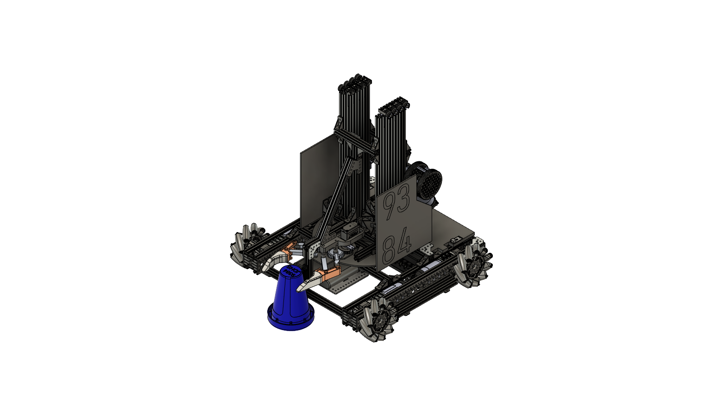
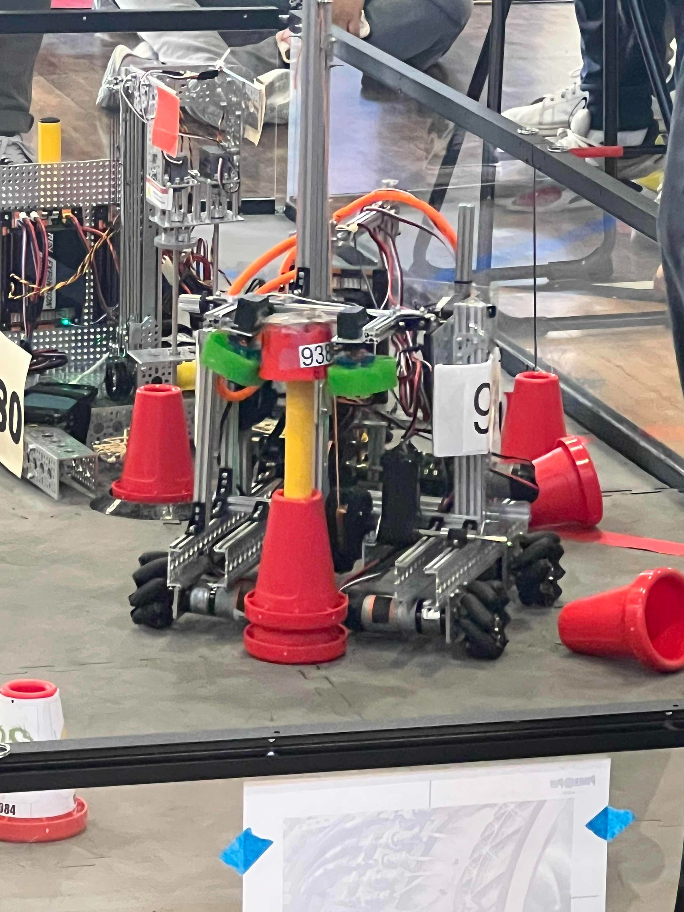
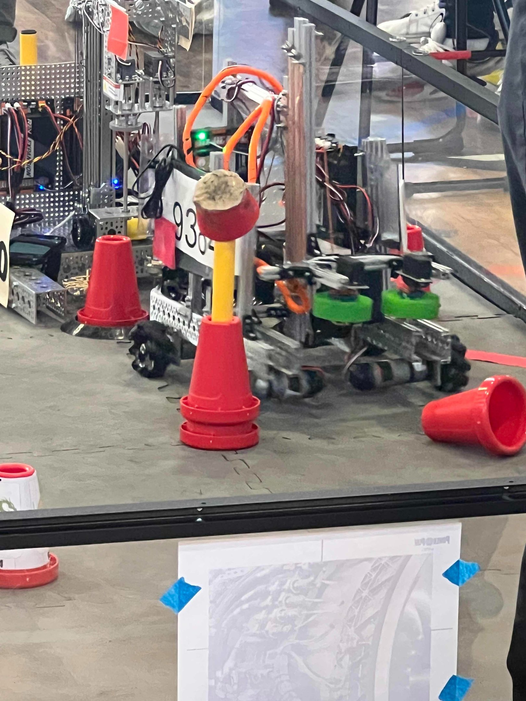
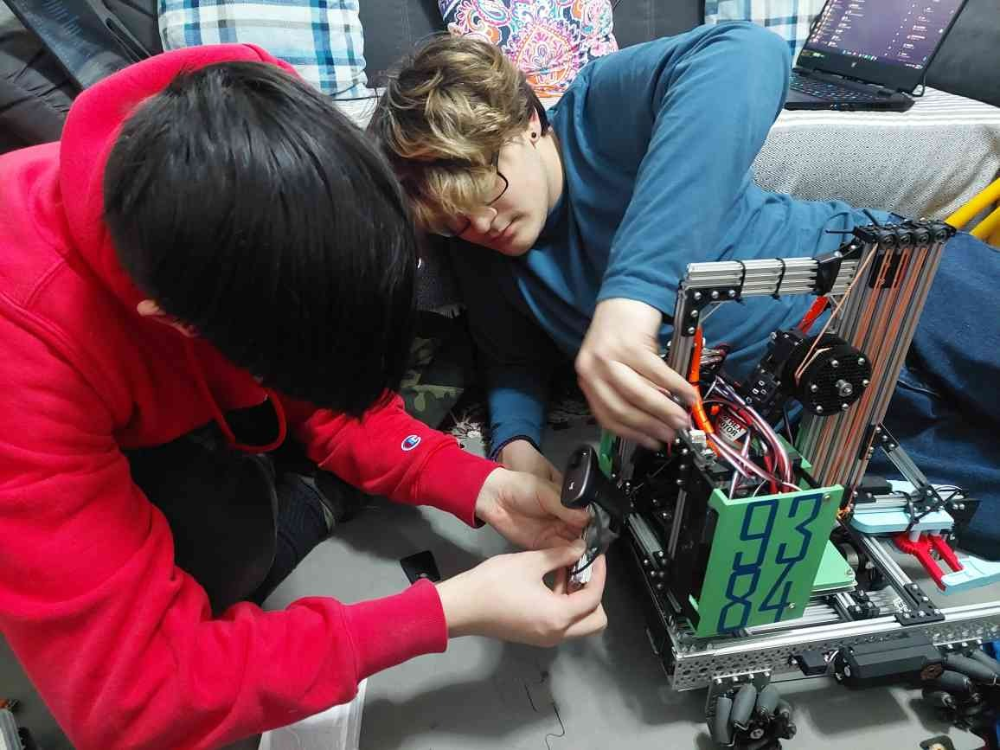
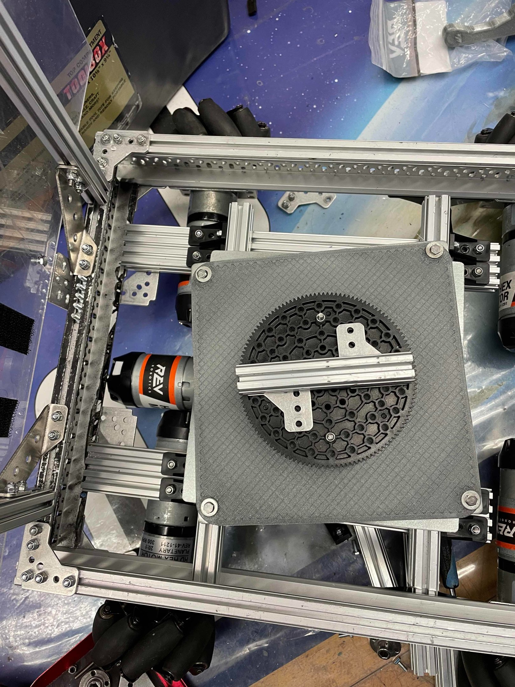
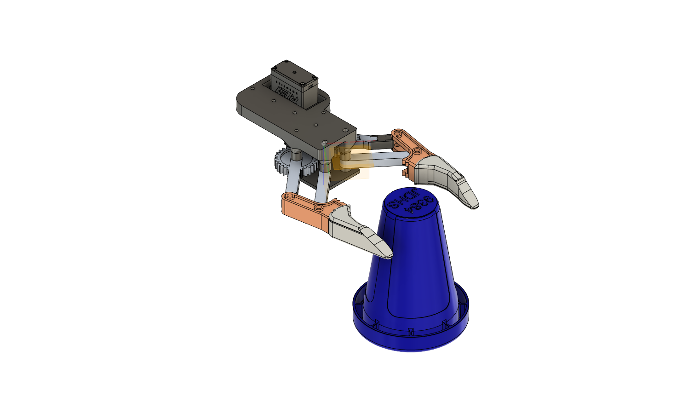
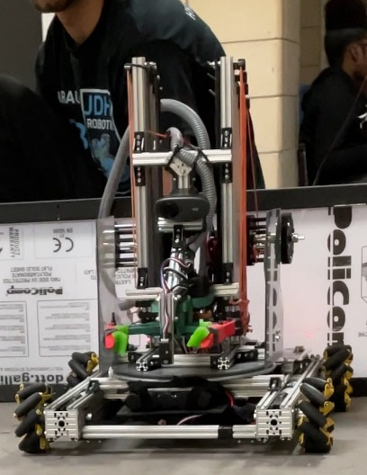

# FTC 9384 2022-2023 Robot - Crabby



**Crabby** was FTC Team 9384 Hydraulic Hydras' robot for the 2022-2023 **POWERPLAY** season. Development began at kickoff on September 10, 2022. Across three major competition iterations, the team developed a mecanum drive base, dual linear-slide lift, cone claw, and compact direct-drive turret.

The turret placed its drive motor's output shaft at the center of rotation. This let the lift and claw aim at junctions without first turning the entire chassis, improving scoring flexibility while keeping the mechanism relatively simple and compact.

- [Read the complete design history](docs/design-history.md)
- [Watch Crabby compete](media/site/crabby-match-video.mp4)
- [View the original project page](https://angelojamesny.com/crabby-2022-23)
- [View the original GrabCAD listing](https://grabcad.com/library/ftc-9384-2022-2023-robot-1)

## The challenge

[POWERPLAY](https://www.youtube.com/watch?v=HsitvZ0JaDc) required robots to collect cones and score them on junction poles of several heights or in marked field areas. Crabby therefore needed:

- Omnidirectional movement for positioning around a crowded junction field.
- Enough vertical reach to score at every junction height.
- Reliable cone acquisition and retention.
- Fast aiming without repeatedly rotating the entire drivetrain.
- A rigid lift that stayed stable at full extension.

## How Crabby evolved

| Stage | Competition period | Main design changes |
| --- | --- | --- |
| 1 | Kickoff to Qualifier 4 | H-frame mecanum chassis, one REV linear slide, and a two-servo compliant-wheel intake. |
| 2 | Qualifier 4 to Super Qualifier | Faster slide gearing, a more reliable claw, and the directly driven turret. |
| 3 | Super Qualifier to State Championship | A second slide, larger turret bearing, bevel-gear drivetrain, lower chassis, and more frame bracing. |

See [the full subsystem breakdown](docs/design-history.md) for the design reasoning, observed failure modes, and changes made between events.

## Project media

<p>
  
  
</p>

<p>
  
  
</p>

<p>
  
  
</p>

The repository contains the seven robot images/renders and the embedded video from the project page. The two original GrabCAD photos are retained separately in [`photos/`](photos/).

## CAD files

| File | Assembly |
| --- | --- |
| [`final bot.step`](cad/final%20bot.step) | Complete robot |
| [`Chassis.step`](cad/Chassis.step) | Mecanum chassis and drive base |
| [`intake.step`](cad/intake.step) | Intake subsystem |
| [`regular lifts.step`](cad/regular%20lifts.step) | Standard lift assembly |
| [`inverted lift.step`](cad/inverted%20lift.step) | Inverted lift assembly |
| [`turret assembled.step`](cad/turret%20assembled.step) | Direct-drive turret assembly |

The downloadable models are STEP files. Open them in Autodesk Fusion 360 or another application with STEP support. The complete model was later reconstructed from photos and videos, so some geometry is approximate; the intake and turret plate are the most accurate portions because they were modeled from the completed robot during the season.

Several assemblies are large and require Git LFS:

```powershell
git lfs install
git clone https://github.com/AloeVeraZ/FTC9384-2023-Robot-Crabby.git
```

## Categories and tags

**Categories:** 3D printing, Educational, Robotics

**Tags:** mecanum drive, mecanum, chassis, automotive, tech, turret, linear slides, lift, drivetrain, drive base, CAD, 3D design, FTC, robotics, plates, CNC, aluminium, design, CAD design, Fusion 360, Autodesk, FIRST, FRC, first tech challange, John Dewey, John D

All original listing metadata and source URLs are recorded in [`grabcad-metadata.yml`](grabcad-metadata.yml). GitHub permits only 20 repository topics, so all 26 GrabCAD tags are preserved in the repository even though they cannot all be displayed as GitHub topics.

## Sources

The engineering history and website media come from [Angelo Demetroulakos' Crabby project page](https://angelojamesny.com/crabby-2022-23). The CAD package was published by [Angelo Demetroulakos on GrabCAD](https://grabcad.com/library/ftc-9384-2022-2023-robot-1) on March 25, 2024.

The portfolio confirms that Crabby is the **2022-2023 POWERPLAY robot**. A reference to 2023-2024 in the GrabCAD description appears to be a season-label typo.
